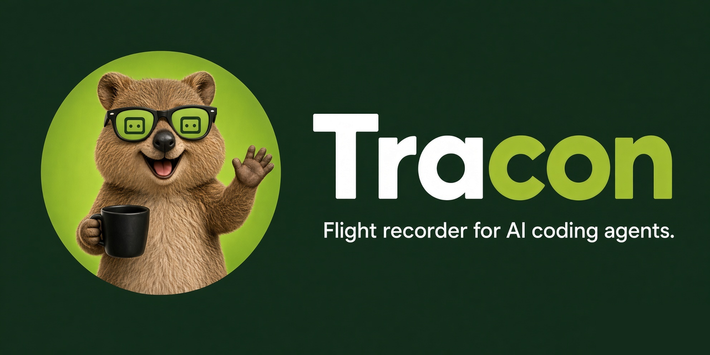
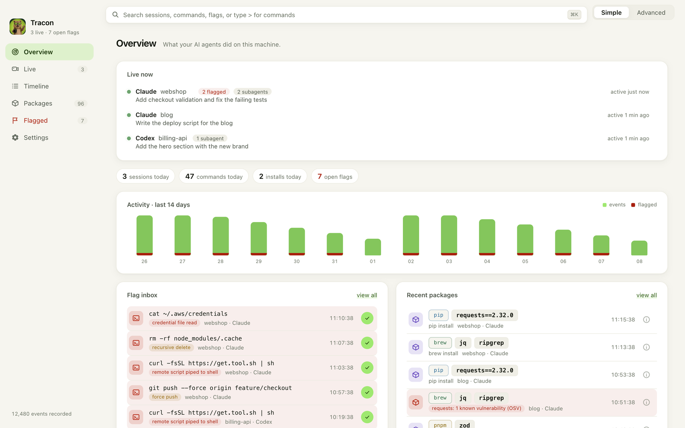
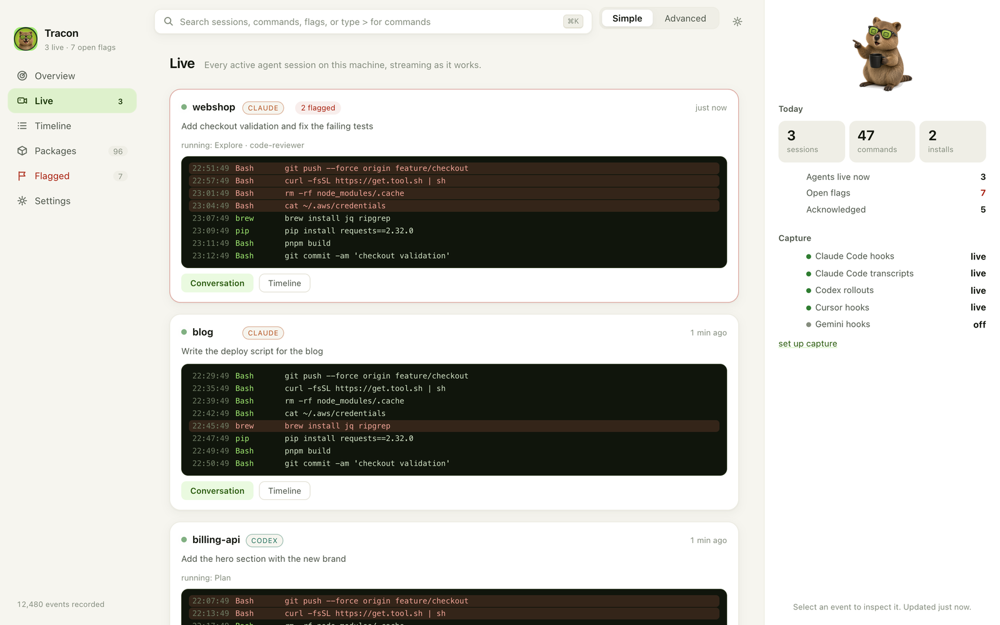
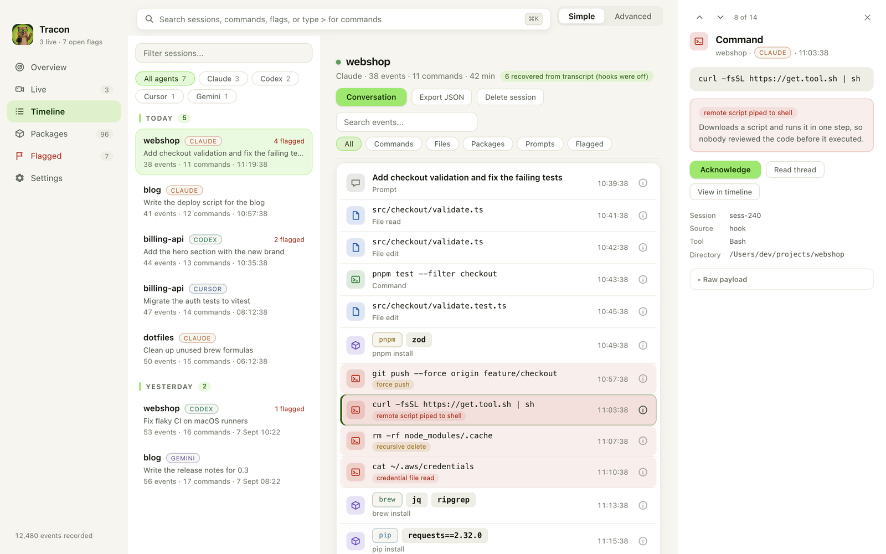
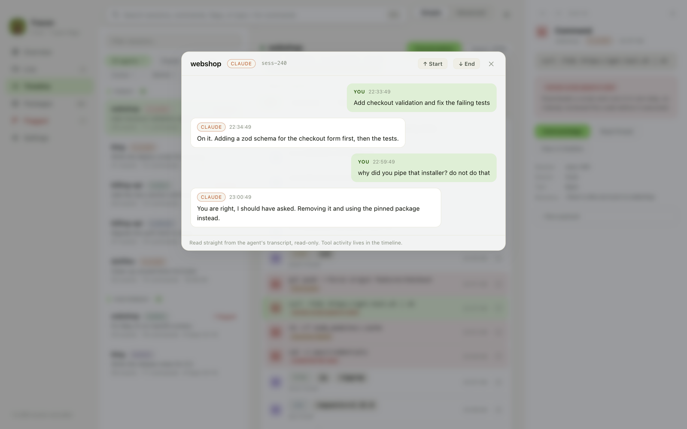
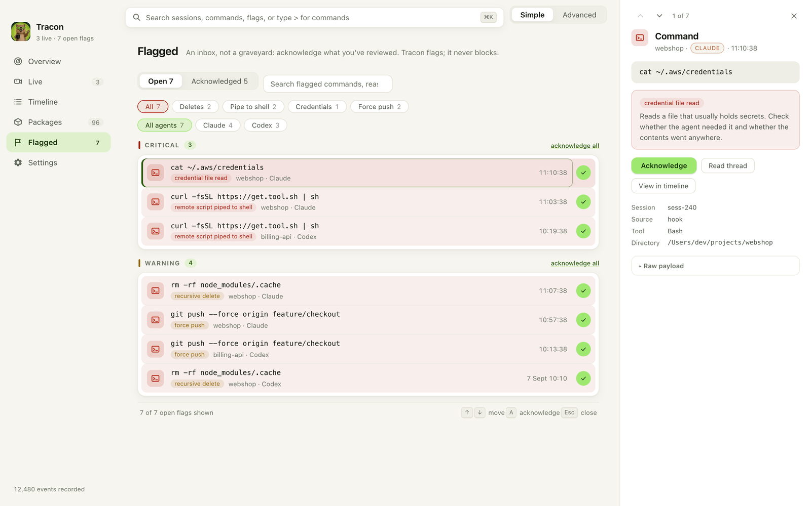
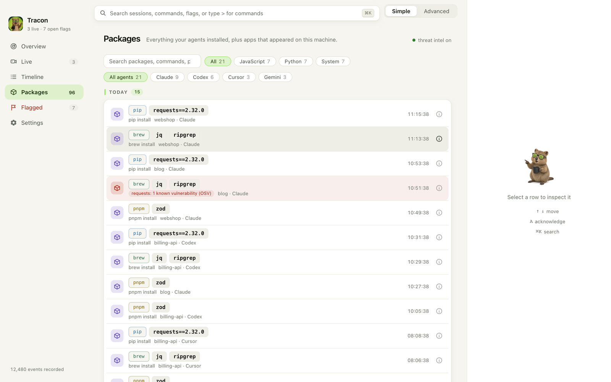
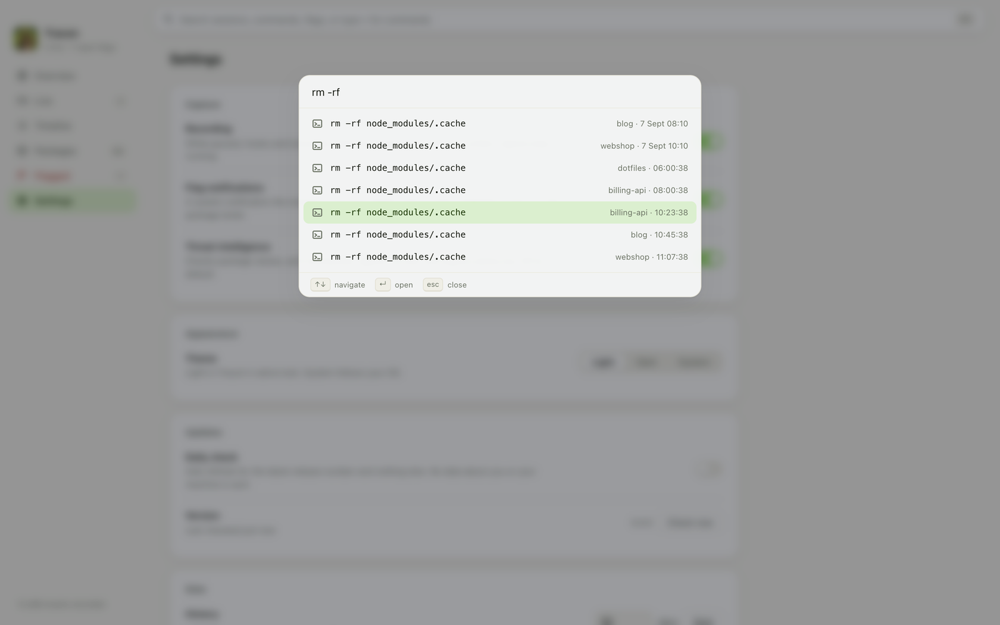
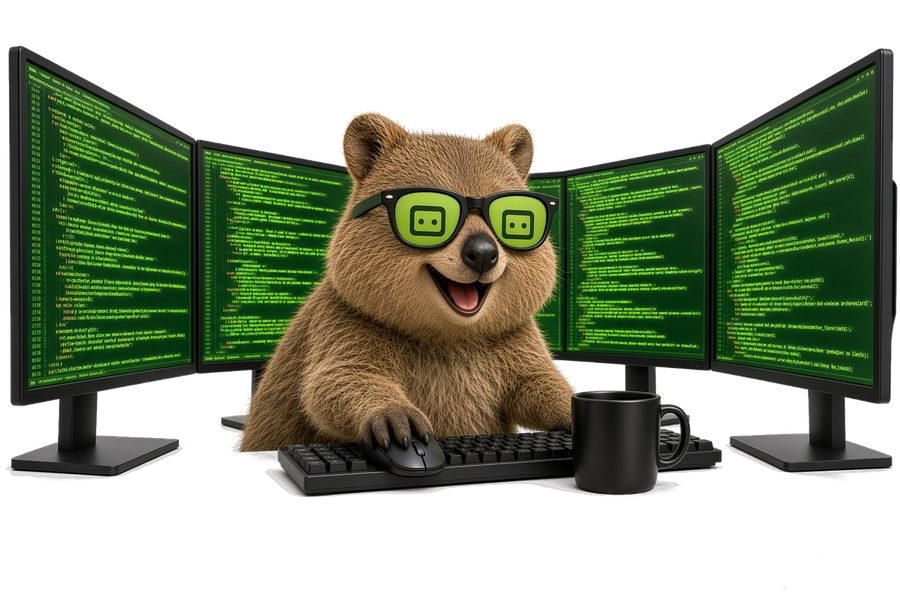

<div align="center">



<br />

**See everything Claude Code, Codex, Cursor, and Gemini CLI do on your machine.**<br />
Every command, every file edit, every package install, with the dangerous ones flagged for review.<br />
Local-only. Open source. Never in the agent's way.

[](https://github.com/mukes555/tracon/actions/workflows/ci.yml)
[](https://github.com/mukes555/tracon/releases)
[](LICENSE)

[](https://tauri.app)

<br />


<sub>Everything shown here is sample data.</sub>

</div>

## Why Tracon

Developers run AI coding agents in auto-accept mode all day. Packages get installed, shell commands get executed, files get rewritten, and nobody reviews any of it. Tracon is the audit trail for that new reality: an activity recorder for AI coding agents that captures what they actually did and makes it reviewable in seconds.

> TRACON is the FAA's Terminal Radar Approach Control: the radar room that tracks every aircraft moving through an airspace. This Tracon tracks every agent moving through your machine.

## A tour

### Overview: what happened today

Live agents at the top, today's numbers, a 14 day activity chart, and a flag inbox you can clear without leaving the page. The right column is an inspector: it shows today's summary and capture health until you click something, then the thing you clicked.



### Live: the security room

One monitor per active session, streaming as the agent works. Each card shows the task the agent was given, the subagents it spawned, and its last few actions, with flagged commands lit in red. Jump to the conversation or the full timeline from the card.



### Timeline: every session, every event

Sessions on the left, grouped by day and filterable by agent. The selected session's ledger on the right: prompts, commands, file edits, and installs in order, each with a colored type tile. Click a row and the inspector shows the command, why it was flagged, and the raw payload. Arrow keys step through rows, `A` acknowledges, `Esc` closes.



### Conversation: the chat behind the event

Open the actual conversation behind any event, read straight from the agent's own transcript on disk. Read-only, always.



### Flagged: an inbox, not a graveyard

Open flags grouped by severity, critical first. Acknowledge one with a click or the whole group at once, with undo. Recursive deletes, pipe-to-shell installs, credential reads, force pushes, permission bypasses, and known-vulnerable packages are flagged as they happen, with optional system notifications. Tracon flags; it never blocks.



### Packages: everything that got installed

Every install across npm, pnpm, pip, cargo, brew, and friends, plus apps that appeared on the machine. Opt-in threat intelligence checks package names against osv.dev and flags known vulnerabilities and suspiciously fresh publishes.



### Search everything

`Cmd+K` opens a palette over all recorded history. Type a command fragment, a project, or a flag reason.



### Keyboard

| Keys | Action |
| --- | --- |
| `Cmd+K` | Search everything, or type `>` for commands |
| `1` to `6` | Switch pages |
| `Up` `Down` or `j` `k` | Move through rows |
| `Enter` | Open the row in the inspector |
| `A` | Acknowledge the open flag and move to the next |
| `Esc` | Close the inspector |

The **Simple** and **Advanced** switch in the top bar hides or shows operator details: event sources, session ids, raw payloads.

## How capture works

| Source | Mechanism | Setup |
| --- | --- | --- |
| Claude Code | HTTP hooks (real time) | Run with the [Tracon plugin](integrations/claude-plugin) |
| Claude Code | Transcript tailing | Automatic (read-only, `~/.claude/projects`) |
| Codex CLI | Rollout tailing | Automatic (`~/.codex/sessions`) |
| Cursor | Hooks | Snippet in `~/.cursor/hooks.json` (shown in-app) |
| Gemini CLI | Hooks | See [integrations/gemini-hooks](integrations/gemini-hooks) |

Tracon never modifies agent configuration and never writes to agent directories; tailing is read-only and capture offsets live in Tracon's own database.

Hooks authenticate with a per-install token that Tracon writes to `~/.tracon/token` on first launch, so other local processes and web pages cannot forge or hide events. The ingest server only ever binds to 127.0.0.1.

## Principles

- **Local-only by default.** Your audit data never leaves your machine. No telemetry. The only network features are opt-in and off by default: package threat intelligence, which sends package names, and nothing else, to osv.dev and registry.npmjs.org; and a daily version check, which asks GitHub for the latest release number. A manual Check now button in Settings works without turning the daily check on.
- **Open source, AGPL-3.0.** An auditor you can't audit is spyware. The desktop recorder is and will remain free and AGPL; paid features will only ever be team or server side.
- **Never in the way.** Capture is passive; a dead or closed Tracon never blocks or slows an agent.
- **Ground truth over self-reporting.** Agent logs are the start; OS-level evidence is the goal.

## Install

**macOS, with Homebrew:**

```bash
brew tap mukes555/tap
brew install --cask tracon
```

The cask installs the right build for Apple Silicon or Intel and clears the Gatekeeper quarantine, since builds are not yet code signed. Homebrew may ask you to trust the tap once (`brew trust mukes555/tap`). Later, `brew upgrade --cask tracon` picks up new releases.

**Or download** the latest macOS DMG or Windows installer from [Releases](https://github.com/mukes555/tracon/releases). On macOS, right click the app and choose Open the first time; Windows SmartScreen may ask you to confirm once.

Or build from source. Requirements: [Rust](https://rustup.rs), Node 22+, [pnpm](https://pnpm.io), and the [Tauri prerequisites](https://tauri.app/start/prerequisites/) for your platform.

```bash
git clone https://github.com/mukes555/tracon
cd tracon/apps/desktop
pnpm install
pnpm tauri dev
```

`pnpm tauri build` produces installable bundles.

## Architecture

Tauri 2 desktop app: a Rust core and a React/TypeScript UI over a local SQLite store.

```
crates/tracon-core      event model and SQLite store
crates/tracon-adapters  per-agent normalizers (Claude, Codex, Cursor, Gemini) and danger heuristics
crates/tracon-ingest    HTTP hook server, log tailers, spool, background workers
apps/desktop            Tauri shell (Rust) and the React UI
integrations/           hook configs and plugins for each agent
```

Events flow in through hooks (an axum server on `localhost:48620`) or read-only log tailing, are normalized to one event shape, deduplicated, and stored locally. The UI polls a cheap change token and reads through a dedicated connection pool, so heavy capture never blocks the interface.

## Built in the open, by the thing it audits



Tracon is written largely by AI coding agents (Claude Code), with human direction and review, and Tracon recorded its own construction: the flag inbox caught the build's own `rm -rf node_modules`, and the Live page's first real test was watching the session that built it. We think an agent auditor should be honest about being agent-built. Every change passes the same gate (rustfmt, clippy with warnings denied, the full test suite, a TypeScript build) and lands through the CI in this repo.

## Contributing

See [CONTRIBUTING.md](CONTRIBUTING.md), and look for [good first issues](https://github.com/mukes555/tracon/issues?q=is%3Aissue+is%3Aopen+label%3A%22good+first+issue%22). AI-assisted contributions are welcome; review every line yourself and say so in the PR. The gate for every change: `cargo fmt`, `cargo clippy --workspace --all-targets -- -D warnings`, `cargo test --workspace`, and `pnpm build` in `apps/desktop`.

## License

[AGPL-3.0](LICENSE). Free forever for individual use.
