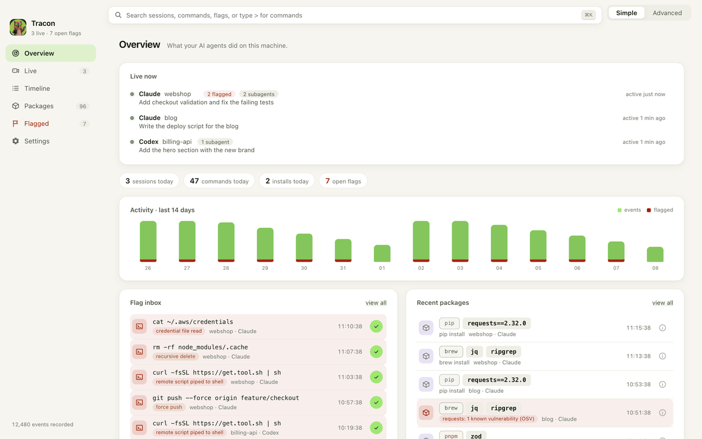

<div align="center">


# Tracon

**The flight recorder for AI coding agents.**

See everything Claude Code, Codex, Cursor, and Gemini CLI do on your machine: every command, every file edit, every package install, with dangerous actions flagged for review. Local-only, open source, never in the agent's way.

[](https://github.com/mukes555/tracon/actions/workflows/ci.yml)
[](https://github.com/mukes555/tracon/releases)
[](LICENSE)

[](https://tauri.app)



</div>

## Why Tracon

Developers run AI coding agents in auto-accept mode all day. Packages get installed, shell commands get executed, files get rewritten, and nobody reviews any of it. Tracon is the audit trail for that new reality: an AI agent activity monitor that records what your agents actually did and makes it reviewable in seconds.

> TRACON is the FAA's Terminal Radar Approach Control: the radar room that tracks every aircraft moving through an airspace. This Tracon tracks every agent moving through your machine.

## Features

- **Overview dashboard.** Live agents, today's vitals, a 14 day activity chart, and a flag inbox you can acknowledge without leaving the page.
- **Session timelines.** Every Claude Code, Codex, Cursor, and Gemini session with its full event ledger: commands, file edits, package installs, prompts.
- **Danger flags.** Recursive deletes, pipe-to-shell installs, credential access, force pushes, and permission bypasses are flagged as they happen, with optional system notifications. Tracon flags; it never blocks.
- **Conversation reader.** Open the actual chat behind any event, read straight from the agent's own transcript on disk, read-only.
- **Package watch.** Everything your agents installed across npm, pnpm, pip, cargo, brew, and friends, plus apps that appeared on the machine. Opt-in threat intelligence checks names against osv.dev.
- **Everything searchable.** A command palette (Cmd+K) over all recorded history.

## How capture works

| Source | Mechanism | Setup |
| --- | --- | --- |
| Claude Code | HTTP hooks (real time) | Run with the [Tracon plugin](integrations/claude-plugin) |
| Claude Code | Transcript tailing | Automatic (read-only, `~/.claude/projects`) |
| Codex CLI | Rollout tailing | Automatic (`~/.codex/sessions`) |
| Cursor | Hooks | Snippet in `~/.cursor/hooks.json` (shown in-app) |
| Gemini CLI | Hooks | See [integrations/gemini-hooks](integrations/gemini-hooks) |

Tracon never modifies agent configuration and never writes to agent directories; tailing is read-only and capture offsets live in Tracon's own database.

## Principles

- **Local-only by default.** Your audit data never leaves your machine. No telemetry. The single exception is opt-in (off by default): package threat intelligence, which sends package names, and nothing else, to osv.dev and registry.npmjs.org.
- **Open source, AGPL-3.0.** An auditor you can't audit is spyware. The desktop recorder is and will remain free and AGPL; paid features will only ever be team or server side.
- **Never in the way.** Capture is passive; a dead or closed Tracon never blocks or slows an agent.
- **Ground truth over self-reporting.** Agent logs are the start; OS-level evidence is the goal.

## Install

Download the latest macOS or Windows installer from [Releases](https://github.com/mukes555/tracon/releases).

Or build from source. Requirements: [Rust](https://rustup.rs), Node 22+, [pnpm](https://pnpm.io), and the [Tauri prerequisites](https://tauri.app/start/prerequisites/) for your platform.

```bash
git clone https://github.com/mukes555/tracon
cd tracon/apps/desktop
pnpm install
pnpm tauri dev
```

`pnpm tauri build` produces installable bundles.

## Architecture

Tauri 2 desktop app: a Rust core and a React/TypeScript UI over a local SQLite store.

```
crates/tracon-core      event model and SQLite store
crates/tracon-adapters  per-agent normalizers (Claude, Codex, Cursor, Gemini) and danger heuristics
crates/tracon-ingest    HTTP hook server, log tailers, spool, background workers
apps/desktop            Tauri shell (Rust) and the React UI
integrations/           hook configs and plugins for each agent
```

Events flow in through hooks (an axum server on `localhost:48620`) or read-only log tailing, are normalized to one event shape, deduplicated, and stored locally. The UI polls a cheap change token and reads through a dedicated connection pool, so heavy capture never blocks the interface.

## Contributing

See [CONTRIBUTING.md](CONTRIBUTING.md). The gate for every change: `cargo fmt`, `cargo clippy --workspace --all-targets -- -D warnings`, `cargo test --workspace`, and `pnpm build` in `apps/desktop`.

## License

[AGPL-3.0](LICENSE). Free forever for individual use.
